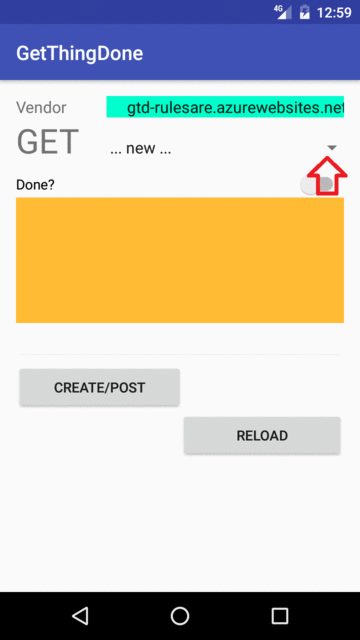

# GTD
* project exercise: get thing done
* tool: Postman
* language: java (android), c# (.Net)

---

# Web/REST API

## Protocol

| API | Description | Request body | Response body | Http Code |  
|---|---|---|---|---|  
|GET /api/todo | Get all to-do items | None | Array of to-do items| 200 |  
| GET /api/todo/{id} | Get an item by ID | None | To-do item | 200  |   
| POST /api/todo | Add a new item 	| To-do item | To-do item |  201  |  
| PUT /api/todo/{id} | Update an existing item | To-do item | None| 204  |  
| PATCH /api/todo/{id} | Update an existing item | To-do item | None |  204  |  
| DELETE /api/todo/{id} | Delete an item | None | None|  204  |  


---

# Server

### REST API Server
* hosting on Azure [screenshot](illustration/Azure_App_Service_deployment_01.png)

### Web Server
(tod)

# Clinet

* #### Android App
* client/GetThingDone
 * 

## To Do List

* #### Web UI

---
# Server, hosting by .Net
* following all steps on "Building Your First Web API with ASP.NET Core MVC and Visual Studio"
 * https://docs.asp.net/en/latest/tutorials/first-web-api.html
* deploy to Windows Azure Web Service
 * https://blogs.msdn.microsoft.com/tomleetaiwan/2013/01/04/asp-net-webwindows-azure-web-sites/
 * https://docs.asp.net/en/latest/tutorials/publish-to-azure-webapp-using-vs.html

## design
```
client  --> http request -->     MVC app  
        <-- http response <--   controller  
                      ^              ^  
                      |              |
                      --------model  | read/write  
                serialize            v  
                              Data Access Layer  
```

### MVC
* model
 * object, representing the data
   * to-do item
* view
 * ?
* controller
 * object, handling http requests and creating the http response

#### QQ (not get the idea yet)
* https://docs.asp.net/en/latest/tutorials/first-web-api.html#add-a-repository-class
 * A repository is an object that encapsulates the data layer, and contains logic for retrieving data and mapping it to an entity model.
 * It’s useful to inject a repository into controllers.
* https://docs.asp.net/en/latest/tutorials/first-web-api.html#register-the-repository
 * Instead of instantiating a TodoRepository inside the controller we will inject an ITodoRepository using the built-in support in ASP.NET Core for dependency injection.


---

## Testing

### CRUD

#### Create
##### -> Request by POST

```
POST /api/todo HTTP/1.1
Host: localhost:61826
Content-Type: application/json

{
	"name": "walk cat",
	"isConplete":false
}
```
##### <- response from server
```
201 Created
Content-Type: application/json; charset=utf-8
Date: Thu, 06 Oct 2016 00:35:37 GMT
Location: http://localhost:61826/api/Todo/0eb01f18-c407-4ea3-bda5-abad2ba6f6c4
Server: Kestrel
Transfer-Encoding: chunked
X-Powered-By: ASP.NET

{
    "key": "0eb01f18-c407-4ea3-bda5-abad2ba6f6c4",
    "name": "walk cat",
    "isComplete": false
}

```

#### Retrieve
##### send Request by GET
```
GET /api/todo HTTP/1.1
Host: localhost:61826
```
##### get response from server
```
200 OK
Content-Type: application/json; charset=utf-8
Date: Thu, 06 Oct 2016 00:40:44 GMT
Server: Kestrel
Transfer-Encoding: chunked
X-Powered-By: ASP.NET

[
  {
    "key": "9e1ae218-c162-4f85-abc3-9f29351f33b5",
    "name": "Welcome",
    "isComplete": false
  },
  {
    "key": "0eb01f18-c407-4ea3-bda5-abad2ba6f6c4",
    "name": "walk cat",
    "isComplete": false
  }
]
```

##### -> Request by GET for specific id
```
GET /api/Todo/0eb01f18-c407-4ea3-bda5-abad2ba6f6c4 HTTP/1.1
Host: localhost:61826
```
##### <- response from server
```
200 OK
Content-Type: application/json; charset=utf-8
Date: Thu, 06 Oct 2016 00:45:44 GMT
Server: Kestrel
Transfer-Encoding: chunked
X-Powered-By: ASP.NET

{
  "key": "0eb01f18-c407-4ea3-bda5-abad2ba6f6c4",
  "name": "walk cat",
  "isComplete": false
}
```

#### Update
##### <- Request by PUT

```
PUT /api/todo/c1c4a0e6-566f-4d34-96ee-cebad066f79a HTTP/1.1
Host: localhost:61826
Content-Type: application/json

{
  "key": "c1c4a0e6-566f-4d34-96ee-cebad066f79a",
  "name": "walk cat",
  "isComplete": false
}

```
##### -> response from server
```
204 No Content
Date: Thu, 06 Oct 2016 01:07:31 GMT
Server: Kestrel
X-Powered-By: ASP.NET
```

#### Update
##### <- Request by PATCH, to update partial
```
PATCH /api/todo/b7e98fc8-7bb9-4e5d-bf45-5bb1fca4b015 HTTP/1.1
Host: localhost:61826
Content-Type: application/json

{
  "name": "walk cat",
  "isComplete": true
}
```
##### -> response from server
```
204 No Content
Date: Thu, 06 Oct 2016 01:13:39 GMT
Server: Kestrel
X-Powered-By: ASP.NET
```

#### Delete
#### -> Request by DELETE, to purge partical id
```
DELETE /api/todo/c21b2153-52fe-4654-94eb-28768267bad2 HTTP/1.1
Host: localhost:61826
```
##### <- response from server
```
204 No Content
Date: Thu, 06 Oct 2016 01:19:07 GMT
Server: Kestrel
X-Powered-By: ASP.NET
```

---

## Phase 1
* all data stored in memory
 * https://docs.asp.net/en/latest/tutorials/first-web-api.html

## Phase 2
* all data stored in filesystem on server

## Phase 3
* all data stored in database on server
 * https://docs.asp.net/en/latest/tutorials/first-mvc-app/index.html

---
# Fundation

## .NET

https://docs.asp.net/en/latest/tutorials/first-web-api.html
